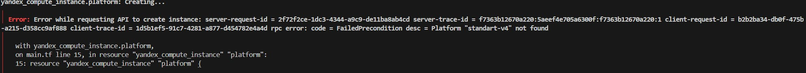
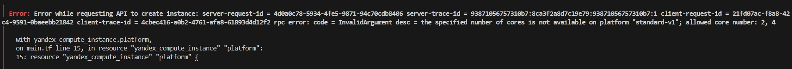
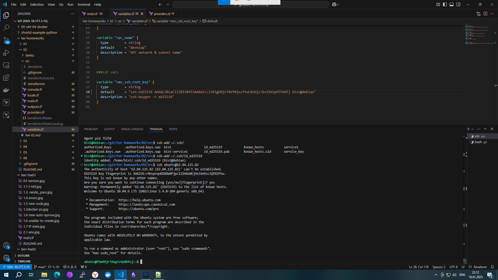
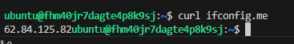
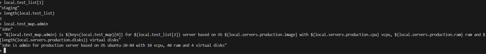
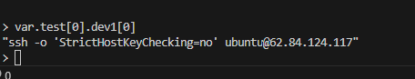
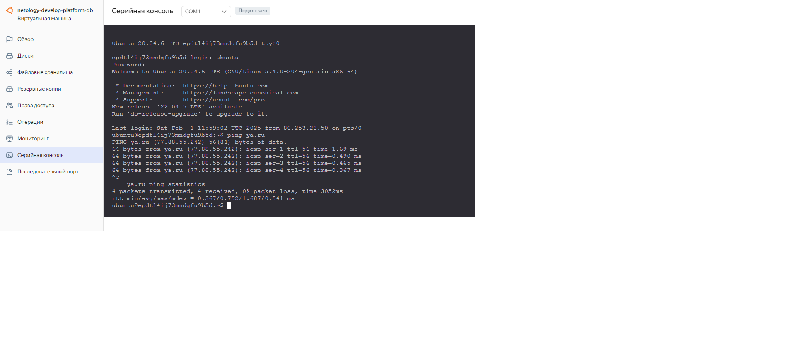

Задание 1
Вопрос: Инициализируйте проект, выполните код. Исправьте намеренно допущенные синтаксические ошибки. Ищите внимательно, посимвольно. Ответьте, в чём заключается их суть.

Ответ: 
- 
Платформы standart-v4 не существует
- 
Недопустимое количество ядер





6. Ответьте, как в процессе обучения могут пригодиться параметры preemptible = true и core_fraction=5 в параметрах ВМ.
- Главным образом это позволяет минимизировать затраты в процессе обучения.

Задание 2


Задание 4


Задание 6
6. ```variable "vms_resources" {
  default = {
    web = {
      cores = 2
      memory = 1
      fraction = 5
    },
    db = {
      cores = 2
      memory = 2
      fraction = 20
    }
  }
}

variable "metadata" {
  default = {
    serial-port-enable = 1
    ssh-keys           = "ubuntu:ssh-ed25519 AAAAC3NzaC1lZDI1NTE5AAAAILL13RigE0jLY4VYNjozf4uCXnOjz/b+ISKSp9TSVGfj bist@debian"
  }
}


7. 
8. 
9. Внес изменения в main

```
data "yandex_vpc_network" "develop" {
  folder_id = var.folder_id
  name      = var.vpc_name
  }

resource "yandex_vpc_subnet" "develop" {
  folder_id      = var.folder_id
  name           = var.vpc_name
  v4_cidr_blocks = var.default_cidr
  zone           = var.default_zone
  network_id     = data.yandex_vpc_network.develop.id
  route_table_id = yandex_vpc_route_table.rt.id
}
resource "yandex_vpc_subnet" "develop_b" {
  folder_id      = var.folder_id
  name           = var.vpc_name_b
  v4_cidr_blocks = var.default_cidr_b
  zone           = var.default_zone_b
  network_id     = data.yandex_vpc_network.develop.id
  route_table_id = yandex_vpc_route_table.rt.id
}

resource "yandex_vpc_gateway" "nat_gateway" {
  folder_id      = var.folder_id
  name = "test-gateway"
  shared_egress_gateway {}
}

resource "yandex_vpc_route_table" "rt" {
  folder_id      = var.folder_id
  name       = "test-route-table"
  network_id = data.yandex_vpc_network.develop.id

  static_route {
    destination_prefix = "0.0.0.0/0"
    gateway_id         = yandex_vpc_gateway.nat_gateway.id
  }
}

resource "yandex_vpc_network" "develop" {
  name = var.vpc_name
```

